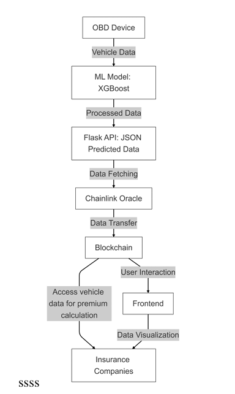

# Decentralized Predictive Maintenance Framework for Dynamic Vehicle Insurance Premiums

[](https://ieeexplore.ieee.org/document/11076756)
[](https://doi.org/10.1109/GINOTECH63460.2025.11076756)
[](https://ethereum.org/)
[](https://xgboost.readthedocs.io/)

---

## Overview

This repository accompanies our IEEE conference publication on a decentralized framework for **dynamic vehicle insurance premium calculation** using **predictive maintenance**, **machine learning**, **Ethereum smart contracts**, and **Chainlink decentralized oracles**.

Traditional vehicle insurance pricing primarily relies on static attributes such as vehicle age, accident history, and driver profile. This work introduces a framework that continuously evaluates **real-time vehicle health** using On-Board Diagnostic (OBD) data and dynamically adjusts insurance premiums through secure blockchain infrastructure.

---

## Proposed System Workflow

<p align="center">
  
</p>

---

## Framework Architecture

### 🚗 Vehicle Health Monitoring

* Real-time OBD sensor data collection
* Engine RPM
* Lubricating Oil Pressure
* Fuel Pressure
* Coolant Pressure
* Oil Temperature
* Coolant Temperature

### 🤖 Predictive Maintenance

* XGBoost-based predictive maintenance model
* Binary engine health classification
* Real-time engine condition prediction
* Vehicle risk assessment

### 🔗 Blockchain Layer

* Ethereum Smart Contracts
* Chainlink Decentralized Oracle Network
* Secure off-chain to on-chain communication
* Immutable vehicle health storage

### 💰 Dynamic Insurance Premium Engine

* Automated premium adjustment
* Transparent pricing model
* Secure vehicle health verification
* Blockchain-backed insurance records

---

## Key Contributions

* Predictive maintenance framework for dynamic vehicle insurance
* XGBoost-based engine health prediction
* Ethereum smart contract implementation
* Chainlink oracle integration
* Secure decentralized vehicle health records
* Transparent insurance premium calculation
* Web3-enabled insurance framework

---

## Experimental Results

### Machine Learning Performance

| Model             | Accuracy | Precision |   Recall | F1 Score |
| :---------------- | -------: | --------: | -------: | -------: |
| **XGBoost**       |  **75%** |  **0.75** | **1.00** | **0.85** |
| Gradient Boosting |      74% |      0.70 |     0.99 |     0.82 |
| Random Forest     |      73% |      0.68 |     0.98 |     0.80 |

### Blockchain Performance

| Metric                   |      Value |
| :----------------------- | ---------: |
| Average Transaction Time | **14.3 s** |
| Oracle Response Time     |  **3.2 s** |
| API Success Rate         |  **99.8%** |
| Storage Efficiency       |  **92.7%** |

---

## Technology Stack

| Category         | Technologies              |
| ---------------- | ------------------------- |
| Machine Learning | XGBoost, Python           |
| Backend          | Flask                     |
| Blockchain       | Ethereum, Solidity        |
| Oracle           | Chainlink                 |
| Frontend         | Web3.js                   |
| Data Source      | On-Board Diagnostic (OBD) |

---

## Repository Structure

```text
.
├── README.md
├── LICENSE
├── CITATION.cff
├── docs/
└── figures/
    └── architecture.png
```

---

## Publication

**Title**

*Decentralized Predictive Maintenance Framework for Dynamic Vehicle Insurance Premiums*

**Conference**

2025 IEEE Global Conference in Emerging Technology (GINOTECH)

**DOI**

https://doi.org/10.1109/GINOTECH63460.2025.11076756

**IEEE Xplore**

https://ieeexplore.ieee.org/document/11076756

---

## Copyright

Copyright © IEEE.

This repository contains supplementary material associated with the published research paper.

The final IEEE-published PDF is **not distributed** through this repository.

Please access the official publication via IEEE Xplore.

---

## Citation

If you use this work in your research, please cite the associated IEEE publication.

Citation metadata is available in **`CITATION.cff`**.

---

## Future Work

* Real-time OBD integration
* Layer-2 blockchain deployment
* IPFS-based decentralized storage
* Deep learning for predictive maintenance
* GPS-assisted risk profiling
* Multi-stakeholder decentralized insurance ecosystem
* Cross-platform vehicle analytics

---

## Authors

* Rajvardhan Magdum
* Mrunmai Shinde
* **Harsh Rudrawar**
* Prajwal Wajire
* Swapnaja Hiray
* Sumitra A. Jakhete
